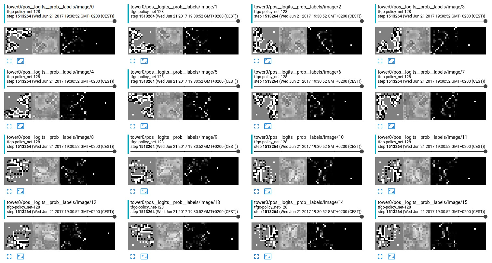

# Policy-Network (SL) from AlphaGO in TensorFlow

Yet another re-implementation of the policy-network (supervised) from Deepmind's AlphaGo. This uses a C++ backend to compute the feature planes presented in the [Nature-Paper](https://gogameguru.com/i/2016/03/deepmind-mastering-go.pdf) and a custom fileformat for efficient storage. To train the network it uses the dataflow and multi-GPU setup of [TensorPack](https://github.com/ppwwyyxx/tensorpack).

# Data + Features

See [here](https://u-go.net/gamerecords/) or [here](https://www.u-go.net/gamerecords-4d/) to get a database of GO games in the SGF fileformat. To handle these games efficiently, we convert them to binary by

        python convert.py --input /tmp/data/ --out /tmp/out

Now this gives several small files (1681414 files here). I just skip all corrupted SGF files. Now, to merge all games within a single file, we dump these games to an LMDB file. This also gives a 90%/10% (1513267/168141) train/val split of the games:

        python go_db.py --lmdb /tmp/ --pattern '/tmp/out/*.sgfbin' --action create

I do not split the positions into train/val, I split the games to makes sure they are totally independent. All training data can be compressed to just (1.1GB) and validation data is just 120MB. 
To simulate the board position from the encoded moves, we setup the SWIG-Python binding `goplanes` of the C++ implementation by:

        cd go-engine && python setup.py install --user

Reading some feature-planes (currently I only implemented 47 of out 49) from random moves extracted from the db gives a speed of 13794.03 examples/s.

        python go_db.py --action benchmark --lmdb /tmp/go_train.lmdb

To see the actual board positions:

        python go_db.py --action debug --lmdb /tmp/go_train.lmdb

# Training 

To train the version with `128` filters just fire up. 

        python tfgo.py --gpu 0,1 --k 128 --path /tmp # or --gpu 0 for single gpu

This might take a some some some ... time. Using one GPU it can batch-evaluate (inference only) approx. 2662 positions/sec.

I saw no big different on a small number of GPUS, this uses the Sync-Training rather than any Async-Training. It will also create checkpoints for the best performing models from the validation phase.

Tensorboard should show something like

At time of writing, I get a validation accuracy of 51.9 % (Top1) and 83.7 % (Top5). Keep fingers crossed I did not mess up the validation part of the code.